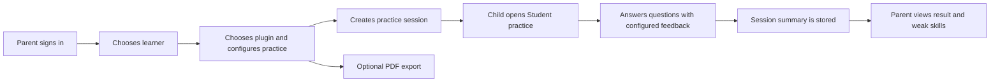
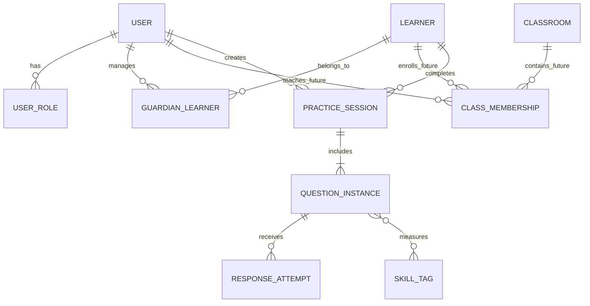

# Kids Exercise Generator - 网页应用原型设计

## 文档状态

| 项目 | 内容 |
| --- | --- |
| 状态 | 产品与技术设计已进入实施；Phase 1 domain foundation 开始落地 |
| 日期 | 2026-05-26 |
| 当前决定 | 产品模型支持 `Parent`、`Teacher`、`Student`、`Admin` 四种角色 |
| 首个可运行原型 | 只实现 `Parent` 与 `Student` 的核心流程 |
| 技术路线 | `FastAPI + Angular + Angular Material (Material 3) + SQLAlchemy 2.0 ORM + Alembic + SQLite` |
| 练习配置模型 | 内置模板提供起点，Parent 可选择题型并配置插件参数；session 保存最终快照 |
| 语言策略 | 默认 `en-CA`；plugin 可携带部分 locale 资源；缺失文案逐 key 回退至英文并记录 |
| 已有基础 | Python 题型插件、preset 组卷、混合练习、PDF 生成与分页 |
| Phase 1 当前进展 | 在线单题型已扩展至 `multiply_by_11`、`same_tens_ones_sum_to_ten`、`square_ending_in_5` 与 `multiply_by_9_99_999`：session 快照、服务端整数判分、安全 Student view、locale fallback 与公开 settings schema/catalog 已建立 |
| Phase 2 当前进展 | FastAPI 已提供 catalog、保存/答题、learner session history 与 results API；SQLAlchemy repository 与 Alembic migrations 已覆盖 learner、session lifecycle、question 和 attempt |
| Phase 3 当前进展 | Angular Material 原型已提供 Parent Studio 与 Student Practice 页面、完成成绩和错题复盘、近期 session 列表，并使用 lazy feature routes 与 mobile-first 布局 |

本文档描述从当前 PDF 生成器演进到在线练习应用的产品边界、数据模型、技术结构和分阶段路线。它不是立即实施清单；在动手编码前，我们应先用它确认第一条用户流程和需要扩展的插件契约。

## 一、目标与原则

### 产品目标

应用最终要帮助家长和老师为孩子提供有针对性的练习，并帮助孩子在明确、低压力、可持续的反馈中巩固计算基础。

网页应用需要逐步支持：

- 家长为孩子创建专项或混合练习。
- 孩子在线答题，系统即时判断答案。
- 记录正确率、用时、尝试次数和对应技能。
- 家长查看练习历史、错题和薄弱题型。
- 老师未来可以管理班级、布置任务并查看班级报告。
- 管理员未来可以管理题型发布状态、用户支持和系统运行配置。
- 同一套题型核心同时服务在线练习与可打印 PDF。

### 设计原则

| 原则 | 含义 |
| --- | --- |
| 先打通真实家庭流程 | 第一阶段优先让家长能布置、孩子能完成、家长能复盘，而不是做完整学习管理系统。 |
| 题型核心与界面分离 | 数学规则、标准答案和判分逻辑属于 domain/plugin，不属于 Angular 页面或 PDF renderer。 |
| 在线 session 是快照 | 孩子开始练习后，题目、seed、配置与插件版本应固定，避免之后修改 preset 影响历史记录。 |
| 对孩子数据克制收集 | 原型不要求孩子邮箱、真实姓名、生日或学校信息；尽量只保存完成练习所必需的数据。 |
| 角色先预留、功能后展开 | 数据模型容纳四类角色，但 MVP 不背负老师课堂管理和管理员后台的实现成本。 |
| 可测试而非神秘评分 | 第一阶段只对确定性强的整数答案自动判分，不急于引入复杂自适应算法或惩罚性积分。 |
| 数据库实现可迁移 | 所有应用 CRUD 使用 ORM，所有 schema 演进使用 migration 工具；业务代码不书写或依赖特定数据库 SQL。 |
| 组件共享但体验分龄 | Angular Material 提供稳定组件与可访问性基础；Student 界面使用面向四、五年级孩子的独立视觉主题与交互节奏。 |
| 移动端优先响应式 | Parent 与 Student 的核心流程必须在手机、平板与桌面可用；布局依据任务重排，而不是只将桌面页面缩小。 |
| 多语言允许局部回退 | UI、template 与 plugin 教学资源分别本地化；plugin 不必覆盖全部语言，缺失内容以明确规则回退英文。 |

## 二、产品形态：一个平台，四种角色体验

不建议在起步阶段创建三个完全独立的系统。更适合当前项目的方式是：共享一个后端和领域模型，由不同角色进入不同的前端功能区域。未来若使用场景、部署方式或安全边界需要，也可以再拆分为多个独立前端。

### 角色定义

| 角色 | 主要职责 | MVP 状态 |
| --- | --- | --- |
| `Parent` | 创建孩子档案、选择练习、启动 session、查看个人孩子结果、导出 PDF | 实现 |
| `Student` | 进入已分配练习、输入答案、接收反馈、完成练习、查看本次结果 | 实现 |
| `Teacher` | 管理班级、分配作业、查看群体与个人报告、设置截止日期 | 数据预留，暂不实现 UI |
| `Admin` | 管理系统、发布题型/preset、处理账号与安全问题、查看运行状态 | 权限预留，暂不实现 UI |

### Parent 与 Teacher 是否分开

产品模型中应从第一天区分 `Parent` 与 `Teacher`，因为两者的授权关系不同：

| 场景 | Parent | Teacher |
| --- | --- | --- |
| 关系对象 | 家庭内的一个或多个孩子 | 一个或多个班级及学生 |
| 分配方式 | 个别孩子、日常自主练习 | 班级、小组、个别学生、截止时间 |
| 数据可见范围 | 仅自己管理的孩子 | 授权课堂中的学生 |
| 典型报告 | 近期进步、薄弱技能、打印题 | 完成情况、班级分布、未完成学生 |

第一阶段不实现 Teacher 页面，但不将 Parent 暂时命名为通用 `Manager`，以免未来权限和数据关系混乱。

### 学生账号的初始取舍

第一阶段不要求孩子注册独立账号，也不要求邮箱。推荐流程为：

1. 家长登录。
2. 家长创建仅含昵称的 learner profile，例如 `Alex`。
3. 家长为该 learner 创建一次练习并点击 `Start practice`。
4. 系统生成短期有效的学生 session link 或设备内启动页面。
5. 孩子在 Student 页面完成本次练习。

以后若需要让孩子从自己的设备反复登录，可以加入家长管理的 PIN、二维码或课堂邀请码，不应一开始就要求儿童自行提供个人联系方式。

## 三、MVP 范围

### 第一条必须跑通的用户流程



### MVP 应包含

| 能力 | 初始实现内容 |
| --- | --- |
| 家长登录 | 自用 MVP 采用最简单的本地认证方案，认证边界预留未来接入外部 SSO/OIDC。 |
| Learner 管理 | 新建、查看、重命名、停用昵称档案。 |
| 练习创建 | Parent 选择一个在线支持的单项题型，可从内置模板开始并调整该 plugin 开放的设置。 |
| 题型参数 | 首批支持题量 `10 / 20 / 30 / 40 / 50 / 100`、是否即时反馈、是否显示计时器、可选 seed，以及题型允许的数字范围配置，例如乘以 `11` 的被乘数位数范围。 |
| 在线练习 | 一题或一屏若干题，输入整数最终答案；若启用即时反馈则提交后立即显示正误，否则完成后统一显示结果。 |
| 练习记录 | 保存每次 session 的题目快照、提交、正误、用时和完成状态。 |
| 家长结果页 | 查看一次练习总结及 learner 的近期 session 列表。 |
| PDF 延续能力 | 家长仍可通过已有 PDF 流程生成可打印题目。 |
| 语言基础 | 首个内容集可仍以 `en-CA` 为主，但 session 与插件契约从第一天支持 locale、资源解析和 fallback 快照。 |

### MVP 暂不包含

| 暂不实现 | 原因 |
| --- | --- |
| Teacher 班级界面 | 需要邀请、授权、班级报告和数据隔离设计，超过家庭验证所需范围。 |
| Admin 可视化后台 | 初期可通过代码、配置和数据库管理；用户价值较低。 |
| 孩子独立注册 | 增加儿童隐私和账号恢复复杂度。 |
| 步骤级 warm-up 在线判分 | 当前 warm-up 包含多个填空，需先设计结构化答案与部分得分。 |
| 分数比较、代数表达式等复杂判分 | 第一阶段整数最终答案即可可靠验证在线流程。 |
| 混合题型在线 session | 首批先把单项题型的配置与判分路径走通，后续再允许组合多个 plugin。 |
| 重试策略配置 | MVP 每题提交一次并记录结果；以后再加入允许重试和 first-try/最终正确率并存的模式。 |
| 连续挑战模式 | 无限生成、答错即结束和最大连续正确记录适合作为后续训练模式。 |
| 自适应推荐/熟练度算法 | 先积累可靠练习记录，再决定算法和产品体验。 |
| 大模型讲解与辅导 | 未来可用于错题解释或针对性帮助，但必须另行设计安全、成本与家长可控边界。 |
| 排行榜、社交、广告、第三方跟踪 | 与学习目标不必要，且增加儿童隐私风险。 |

## 四、在线练习内容与现有 PDF 的关系

### 现有资产可复用的部分

当前项目已经提供：

- 题型插件及数学出题规则。
- preset 对题量、格式和题型组合的声明。
- 随机 seed 复现能力。
- 多种速算专题与混合卷。
- PDF renderer。

网页原型应复用同一生成核心，而不是在前端复制数学出题逻辑。

### PDF preset 不等于在线练习配置

目前 beginner PDF 通常包含两种区域：

```text
Warm-up: 带英文方法提示和步骤填空
Practice: 只填写最终答案
```

在线 MVP 推荐只支持可可靠自动判分的 `expression_with_answer_blank` 区域。打印 preset 可以继续表达固定教学版面，但网页练习不能只让用户选择几个固定在线 preset；Parent 应可以按一次训练的需要选择题型和修改允许的参数。

建议将配置分为三层：

| 层级 | 用途 | 示例 |
| --- | --- | --- |
| `PluginDefinition` | 题型能力、可配置 schema、验证规则和默认值 | `multiply_by_11` 支持被乘数位数范围，最多允许 5 位数 |
| `PracticeTemplate` | 系统或用户保存的便捷起点，可预填一个或多个 plugin 配置 | `Two-Digit Multiply by 11 - Beginner` |
| `PracticeSessionSnapshot` | Parent 本次确认后不可变的实际生成配置和题目实例 | 本次选择 20 题、2 至 3 位数、即时反馈开启 |

MVP 先让 Parent 针对一个 plugin 配置练习。以后增加混合训练时，一个 `PracticeTemplate` 或一次创建请求可以包含多个 plugin section、各自的题量与配置，再合并和打乱。

这一模型也适用于 CLI：现有 TOML preset 继续提供快捷生成方式，未来命令行入口可加入交互式参数编辑或配置 override，而无需另造一套题型参数语义。Web UI 与 CLI 都应读取同一套 plugin setting schema 和校验规则。

### 配置示例：乘以 11

例如 `multiply_by_11` 在线配置不应被锁死在现有两位数或三位数 preset 中，Parent 可以选择：

```json
{
  "plugin_id": "multiply_by_11",
  "question_count": 20,
  "settings": {
    "multiplicand_digits": [2, 3],
    "strategies": ["no_carrying", "with_carrying"]
  },
  "feedback_mode": "immediate",
  "show_timer": true
}
```

以后可以允许 `multiplicand_digits = [5]` 或 `[2, 3, 4, 5]`，但最大位数必须由 plugin schema 限制和验证，不能仅靠前端输入框约定。对其他插件，同一机制可表达是否允许负数、小数、除法余数或 operand 的位数范围。

### 在线能力声明

未来 preset 或 section 应能声明可支持的 delivery mode：

```text
pdf_printable
web_final_answer
web_guided_steps        # 后续
```

插件也应声明它支持的判分类型，例如：

```text
integer_exact
fraction_equivalent     # 后续
decimal_tolerance       # 后续
expression_equivalent   # 后续
```

插件的 settings schema 同时服务：

- PDF/TOML preset 加载验证。
- Web UI 动态显示允许的题型设置。
- FastAPI 创建 session 时的服务端校验。
- 未来 CLI 的交互式参数编辑或 command-line overrides。

## 五、插件契约的下一步扩展

### 当前缺口

现有 PDF 输出主要依赖题面字符串。在线答题需要知道标准答案、技能标签、判分方式和服务端可验证的数据，因此 `Question`/plugin 契约需要扩展，但不应为了网页而牺牲 PDF 的简洁性。

### 建议的题目实例结构

以下是概念模型，并非立即实施的 Python 类定义：

```json
{
  "id": "session-question-id",
  "plugin_id": "same_tens_ones_sum_to_ten",
  "plugin_version": "initial",
  "format_id": "expression_with_answer_blank",
  "prompt": {
    "type": "arithmetic_expression",
    "left_operand": 43,
    "operator": "multiply",
    "right_operand": 47,
    "display_text": "43 x 47 = ____"
  },
  "evaluation": {
    "answer_type": "integer_exact",
    "expected_value": 2021
  },
  "skills": [
    "mental_multiplication",
    "same_tens_ones_sum_to_ten"
  ],
  "metadata": {
    "strategy": "two_digit_ones_product",
    "difficulty": "beginner"
  }
}
```

关键安全约束：`evaluation.expected_value` 只保存和使用在服务端；发送到 Student 前端的 DTO 不包含标准答案。

### 插件未来需要负责的能力

| 能力 | 责任 |
| --- | --- |
| `generate` | 根据设置和 seed 生成结构化题目。 |
| `render_prompt` | 向 PDF 或 Web renderer 提供可显示题面。 |
| `evaluate_answer` | 服务端判断答案正确与否，并可返回规范化输入。 |
| `skill_tags` | 为练习报告和以后推荐算法标记技能。 |
| `supported_delivery_modes` | 声明可用于 PDF、最终答案网页练习或未来步骤题。 |
| `difficulty_metadata` | 为将来的难度选择与分析提供基础。 |

### 第一版判分范围

第一版只实现：

```text
answer_type = integer_exact
```

输入规则建议为：

- 允许前后空格。
- 允许整数负号，为未来正负数题型提前兼容。
- 不允许表达式输入，例如 `40 * 50 + 21`，第一版要求最终整数。
- 空输入不提交。
- 答案提交记录为一次 attempt；MVP 每题只接受一次正式提交，重试配置留待后续设计。

## 六、核心数据模型

### 领域对象关系



### 主要实体

| 实体 | 目的 | MVP |
| --- | --- | --- |
| `User` | 可登录的成人用户；以后也容纳管理员与老师 | 实现 Parent 账号 |
| `UserRole` | 用户的角色授权，如 `parent`、`teacher`、`admin` | 数据模型支持四角色 |
| `Learner` | 儿童学习档案，不等于登录账号 | 实现 |
| `GuardianLearner` | Parent 对 Learner 的管理关系 | 实现 |
| `Classroom` | Teacher 管理的教学集合 | 预留 |
| `ClassMembership` | Teacher/Learner 与班级的关系 | 预留 |
| `PracticeTemplate` | 系统或用户保存的可修改练习起点，保存 plugin 设置组合 | MVP 实现单 plugin 模板 |
| `PracticeSession` | 一次实际在线练习的固定快照与状态 | 实现 |
| `QuestionInstance` | session 中的一道生成题及服务端判分材料 | 实现 |
| `ResponseAttempt` | learner 的一次答案提交及判定 | 实现 |
| `SkillTag` | 问题所训练的技能标签 | 实现基础标签 |
| `PdfExport` | 导出过的 PDF 记录或生成请求 | 可后置 |

### User 与 Learner 不合并

`Learner` 不应直接作为常规 `User` 注册，原因包括：

- 初期不需要孩子自行登录。
- 能避免存储儿童邮箱等不必要信息。
- Parent 与 Teacher 将来都可能有权查看同一个 learner 的不同范围数据。
- 等真正需要学生长期账号时，可以新增认证关联，而不必重构练习历史。

### PracticeSession

一次 session 应保存：

| 字段类型 | 示例或用途 |
| --- | --- |
| 身份关系 | `learner_id`、`created_by_user_id` |
| 来源 | plugin/template ID、插件版本快照、最终配置快照、seed |
| 状态 | `created`、`in_progress`、`completed`、`abandoned` |
| 时间 | 创建时间、开始时间、结束时间、允许的计时模式 |
| 模式 | `fixed_length`；未来预留 `streak_challenge` |
| 展示设置 | requested locale、解析后的文案与 locale/fallback 元数据、标题、题目顺序、`feedback_mode`、是否显示计时器 |
| 汇总结果 | 正确题数、总题数、总尝试数、总用时；重试上线后再增加首次正确指标 |

每次 session 应实例化并保存实际题目，而不是每次读取当前 preset 重新生成。否则未来修改插件或 preset 后，历史结果可能无法解释或复现。

### QuestionInstance 与 ResponseAttempt

`QuestionInstance` 保存：

- 所属 session。
- 在 session 中的显示顺序。
- 插件标识、格式标识、策略标识。
- 题面快照，以及题目附带教学文案实际采用的 locale/fallback 信息。
- 服务端标准答案与判分类型。
- 技能标签。

`ResponseAttempt` 保存：

- 所属 question 与 session。
- 第几次尝试。
- 原始输入和规范化输入。
- 是否正确。
- 提交时间。
- 从该题首次显示到本次提交的耗时。

### 报告指标

MVP 报告可从 session 与 attempts 聚合得到：

| 指标 | 说明 |
| --- | --- |
| Completion | 是否完成整套题 |
| Accuracy | 答对题数 / 总题数 |
| Total time | 从开始到完成的总时间 |
| Average response time | 每题提交前平均耗时 |
| Skill breakdown | 按技能标签汇总正确率与耗时 |

第一版不需要将这些指标压缩成一个不透明的“能力分”。可解释的结果更适合家长判断下一次练什么。若后续开放重试，再增加 `First-try accuracy`、`Final accuracy` 与 `Attempts per question`。

长期可以在同一份 `ResponseAttempt` 与 skill 数据上增加历史趋势统计，例如每个题型的正确率、平均耗时和连续多次练习的进步变化，而无需改变孩子答题时的核心流程。

## 七、用户体验草图

### Parent 入口

建议初始路由和页面如下：

| 路由概念 | 页面目标 |
| --- | --- |
| `/manage/login` | 家长登录 |
| `/manage/learners` | 查看和创建 learner profiles |
| `/manage/learners/:id` | 查看某个孩子近期练习与薄弱技能 |
| `/manage/assign` | 选择题型，设置题量、数字范围、反馈与计时方式，创建练习 |
| `/manage/worksheets` | 从现有打印练习卷目录选择 preset 并下载 PDF |
| `/manage/sessions/:id` | 查看一次练习结果、打印或再次生成类似练习 |

家长首页最应突出：

- `Start a practice` 主动作。
- 每个孩子最近一次完成结果。
- 最近容易出错的技能。
- 可快速重复的练习模板。

### Parent 响应式行为

Parent 可能在手机上快速布置练习，也可能在桌面查看统计。Manage 界面应随任务和设备调整密度：

| 页面 | 手机 | 平板/桌面 |
| --- | --- | --- |
| Learner list | 卡片列表与醒目的 `Start a practice` 操作 | 卡片或列表并排显示近期表现 |
| Session creation | 单列分步骤设置：learner、题型、参数、反馈/计时、确认 | 参数面板与预览/摘要可并排 |
| Session report | 摘要优先，技能明细折叠或向下滚动 | 摘要、题目详情与技能拆分可分栏 |

管理端使用 Material 的高效组件，但在手机上不能依赖宽表格或 hover 才能完成关键动作。

### Student 入口

建议初始路由：

| 路由概念 | 页面目标 |
| --- | --- |
| `/learn/session/:token/start` | 显示练习标题、题量和开始按钮 |
| `/learn/session/:token/play` | 答题界面 |
| `/learn/session/:token/result` | 本次完成结果 |

Student 界面原则：

- 界面使用英文，符合当前孩子学习环境。
- 针对约 9 至 11 岁学生设计：友好、有活力，但不幼儿化。
- 算式、数字输入和主要按钮明显大于管理端控件，适合手机、平板或笔记本。
- 一次优先聚焦一道题，减少视觉噪音。
- 启用即时反馈时，正误反馈清晰但不过度惩罚；关闭即时反馈时，不在练习过程中揭示判定。
- 计时器可见性由家长设置，避免时间压力影响初期体验。
- 进度提示应鼓励持续完成，例如清晰的题号或进度条，而不是制造紧张感的排行榜。
- 动效限于答对反馈、进入下一题和完成庆祝等关键时刻，避免页面过度喧闹或分散注意力。
- 不展示答案数据或可被浏览器轻易读取的判分信息。

### Student 视觉方向

Student 端不直接复用 Parent 管理台的视觉密度。建议的设计语言是：

| 方面 | Student 方向 |
| --- | --- |
| 气质 | 清爽、有能量、可信任，不像考试后台，也不偏低幼动画。 |
| 色彩 | 温暖明亮的主色配合高对比文字；绿色用于正确反馈，错误反馈避免刺眼或带羞辱感。 |
| 字体 | 选择易读且稍有亲和感的字体；数学题面和数字输入需要特别清晰。 |
| 布局 | 中央 question card 为唯一视觉中心，周围只保留进度、可选计时和必要操作。 |
| 输入 | 数字输入框大、焦点状态醒目；键盘输入顺畅，手机和平板上有合适的数字键盘行为。 |
| 反馈 | 正确时有短促积极确认；错误时使用平静文字，不使用警报式视觉。 |
| 完成感 | 完成页可有轻量庆祝动效和清楚的成绩总结，不引入与学习无关的刺激机制。 |

这套设计应通过单独的 Student theme tokens 实现，而不是在每个页面中零散覆盖 Material 样式。

### Student 响应式行为

孩子可能直接拿手机或平板做练习，因此 Student 端采用 mobile-first 布局。不同视口下不改变题目内容和判分规则，只改变空间组织方式：

| 设备范围 | 答题布局建议 |
| --- | --- |
| 小屏手机 | 单列满宽 question card；题面、数字输入与提交按钮位于首屏主区域；进度与可选计时器压缩到顶部；不出现横向滚动。 |
| 大屏手机/平板竖屏 | 单列居中答题卡，保留更舒适留白；结果摘要与反馈可在卡片下方展开。 |
| 平板横屏/桌面 | 居中主答题区域，可在不抢注意力的位置显示进度、计时与 session 信息；仍保持一道题为焦点。 |

输入细节要求：

- 数值答案字段应提示移动浏览器使用数字键盘，同时保留负号支持，为未来负数题型准备。
- 提交按钮在手机上应足够大且接近输入区域，避免孩子频繁移动手指。
- 屏幕较矮或软键盘弹出时，题面与输入区域不能被重要导航遮挡。
- 横竖屏切换不得清空当前输入或重置题目计时状态。
- 即时反馈动画和完成庆祝不应导致小屏页面跳动或需要滚动才能继续。

### Student 完成页

第一版完成页建议显示：

```text
Practice Complete

Correct: 27 / 30
Time: 6:24

Keep Practising:
Multiply by 11 with carrying
```

若家长启用了即时反馈且答案错误，初期可在做题时提供：

```text
Not correct.
```

MVP 不加入重试配置，因此提交后进入下一题并在结果页复盘。允许重试和在错误后展示方法提示留到后续设计；后者需要插件提供可分级的 hints。

### Teacher 与 Admin 的未来入口

虽然不实施，路由边界可预留为：

| 区域 | 未来路由前缀 | 功能 |
| --- | --- | --- |
| Teacher | `/teach` | classrooms、assignments、reports |
| Admin | `/admin` | user support、preset publishing、system health |

## 八、评分、计时与未来自适应

### 判分与反馈模式

MVP 的判分发生在服务端：

1. Student 前端提交输入答案。
2. API 根据 session 中保存的 `QuestionInstance` 找到 evaluator。
3. evaluator 规范化输入并判定是否正确。
4. API 保存 `ResponseAttempt`。
5. API 根据 `feedback_mode` 决定是否立即向 Student 返回正误；无论是否即时显示，尝试结果都会写入练习记录。

不应在浏览器端保存标准答案后由 Angular 自行判断，因为这会让答案暴露在网络响应或前端状态中，并削弱结果可靠性。

MVP 支持 Parent 设置：

```text
feedback_mode = immediate   # 每题提交后告诉孩子正误
feedback_mode = deferred    # 完成后在结果页统一呈现
```

MVP 不实现重试开关；每题只接受一次正式提交。未来引入重试时，可以继续保存每一次 attempt，并同时展示 first-try accuracy 与最终完成表现。

### 计时

计时可以第一阶段实现，但需要明确它是练习反馈指标而非高风险考试监考：

| 时间数据 | 保存方式 |
| --- | --- |
| Session 开始与完成 | 以后端时间为准 |
| Question 首次呈现 | 前端触发事件，后端记录接收时间 |
| Answer 提交 | 后端接收提交时间 |
| 浏览器切出/中断 | MVP 不必精确侦测，可在以后需要更严谨分析时增加 |

### 分数

MVP 使用透明分数，不采用 IXL 风格的动态 SmartScore：

- `correct / total`
- `first_try_correct / total`
- `elapsed_time`
- `skill_breakdown`

以后若累积了足够使用经验，可以研究：

- 连续正确 streak。
- 速度和正确率共同衡量的熟练度趋势。
- 针对技能标签的掌握度估计。
- 基于错误模式推荐下一份练习。

任何自适应算法都应能够解释“为什么推荐这份练习”，并避免一次错误造成明显挫败体验。

### 后续挑战模式

未来可以增加独立于固定题量练习的 `streak_challenge`：

```text
Generate one question at a time.
Correct answer -> continue to the next question.
Wrong answer -> challenge ends.
Result -> maximum correct streak and elapsed time.
```

该模式不需要预先实例化无限题目；session 应保存 seed/生成状态与已经展示过的每个 `QuestionInstance`，保证历史能够复查。成绩至少记录最大连续正确数和总用时，是否以速度参与排名或个人记录比较，留到体验验证后决定。

### 未来的解释型辅助

当积累出错题和技能统计后，可以探索让大模型生成面向孩子的解释或针对性练习建议，例如解释为什么 `43 x 47` 可以快速计算。但它不属于 MVP，也不应直接承担正确答案判定：

- 数学判分继续由确定性的 plugin evaluator 完成。
- 大模型说明需要家长可控、可关闭，并考虑年龄适宜性和错误风险。
- 不向第三方模型传输不必要的 learner 身份或完整历史。
- 若加入该功能，应另行记录隐私、成本、提示词与安全测试设计。

## 九、技术架构

### 选择 `FastAPI + Angular + Angular Material + SQLAlchemy + Alembic + SQLite` 的理由

| 技术 | 理由 |
| --- | --- |
| `FastAPI` | 与现有 Python 题型和 PDF 核心自然整合；API schema 明确；适合逐步增加认证和数据库层。 |
| `Angular` | 对多角色、路由分区、表单与可测试 UI 的中型应用结构友好；将 Parent/Student/Teacher/Admin 功能域组织清楚。 |
| `Angular Material` | Angular 团队维护的可访问、可测试组件基础；Material 3 theming 可为管理端和 Student 端配置不同 color、typography 与 density 体验。 |
| `SQLAlchemy 2.0 ORM` | Python 领域对象与关系数据库之间的持久化边界成熟明确，支持 SQLite 与未来 PostgreSQL；所有 CRUD 通过 ORM session/repository 完成。 |
| `Alembic` | SQLAlchemy 官方配套 migration 工具，用版本化 migration 管理 schema 演进，替代手动修改数据库结构。 |
| `SQLite` | 本地家庭原型部署成本低，足够验证 session、attempt 与报告数据模型；只作为初期数据库实现。 |

未来若进入多人托管或学校场景，数据库可以从 SQLite 迁移到 PostgreSQL，而题型、session domain、API 契约与绝大多数 repository 行为不应因此变化。

### ORM 与 migration 决定

后端持久化层采用：

```text
SQLAlchemy 2.0 ORM     database mapping and CRUD
Alembic                versioned schema migrations
SQLite                 prototype database
PostgreSQL             likely hosted-production migration target
Pydantic schemas       API request/response DTOs, separate from ORM entities
```

目前不优先选择 `SQLModel`。它对 FastAPI 的简单 CRUD 很便利，但仍建立在 SQLAlchemy 之上，且 migration 仍需要 Alembic。我们的数据模型将包含角色授权、session 快照、attempt 历史与以后课堂关系，直接使用 SQLAlchemy ORM 能使持久化边界与迁移工具更明确，也避免将 API schema 与数据库 entity 过度绑紧。

### 数据访问硬约束

| 约束 | 说明 |
| --- | --- |
| 不手写应用 SQL | API service、domain service 与 repository 不拼接或执行原始 SQL 字符串。 |
| CRUD 统一走 ORM | 创建、查询、更新、删除均通过 SQLAlchemy ORM model、relationship 和 session 完成。 |
| Schema 统一走 Alembic | 不在应用启动时调用 `create_all()` 作为正式升级方式，不手动编辑生产数据库。 |
| Migration 不写原始 SQL | migration 由 Alembic autogenerate/operations 管理，不通过 `execute("...")` 或手写 DDL 写数据库专属 SQL。 |
| DTO 与 entity 分离 | FastAPI/Pydantic response schema 不直接作为 ORM table model；尤其避免把标准答案随序列化暴露给 Student API。 |
| Repository 屏蔽数据库 | domain/service 依赖 repository 接口而不是 SQLAlchemy query 细节，便于测试与切换数据库。 |
| 数据库无关字段设计 | 使用跨 SQLite/PostgreSQL 可表达的基本字段与约束；避免在 MVP 中使用仅某个数据库支持的功能。 |

默认规则是代码中不出现手写 SQL。若未来存在绝对充分、ORM/Alembic operations 无法合理表达的理由，必须先单独讨论、记录架构决策和迁移代价，并加入跨数据库验证后才可例外处理，而不是在实现中悄悄加入 raw SQL。

### 建议总体结构

```text
Kids_Exo/
  kids_exo/
    plugins/                 # 已有题型生成逻辑，后续加入在线判分契约
    renderers/pdf/           # 已有 PDF 渲染
    domain/                  # 未来：session、answer、skills 领域逻辑
    api/                     # 未来：FastAPI routers 与 DTO
    persistence/
      models/                # 未来：SQLAlchemy ORM entities
      repositories/          # 未来：仅使用 ORM 的 data access
      database.py            # 未来：engine/session and configuration
      migrations/            # 未来：Alembic migration environment/versions
  web/
    src/app/
      core/                  # auth, API client, guards, locale
      shared/                # shared components and models
      manage/                # Parent UI
      learn/                 # Student UI
      teach/                 # reserved feature boundary
      admin/                 # reserved feature boundary
  presets/
  docs/
```

### 单体优先

第一阶段建议采用一个 Python API 服务和一个 Angular SPA，而不是拆微服务或多独立部署：

- 题型生成和判分在同一 Python 进程中最简单可靠。
- SQLite 更适合单应用写入。
- SQLAlchemy ORM 和 Alembic 将 SQLite 限制在基础设施配置层，不让应用逻辑依赖 SQLite。
- 四角色仍可通过路由和授权边界明确隔离。
- 若以后学校使用规模、部署或安全需求变化，再决定是否拆分应用。

## 十、后端 API 边界

以下为建议 API 轮廓，不代表已经实现或最终路径名称。

### Parent 与 learner

| Method | Path | 用途 |
| --- | --- | --- |
| `POST` | `/api/auth/login` | 家长登录 |
| `GET` | `/api/me` | 获取当前用户与角色 |
| `GET` | `/api/learners` | 获取家长可管理的 learner |
| `POST` | `/api/learners` | 创建 learner nickname profile |
| `GET` | `/api/learners/{id}` | 查看 learner 概况 |
| `PATCH` | `/api/learners/{id}` | 重命名或停用档案 |

### Catalog 与练习创建

| Method | Path | 用途 |
| --- | --- | --- |
| `GET` | `/api/practice-plugins` | 获取在线可用题型、可配置 schema 及教学资源 locale coverage |
| `GET` | `/api/practice-templates` | 获取作为便捷起点的系统或用户模板及其可用语言信息 |
| `GET` | `/api/practice-templates/{id}` | 获取模板预填配置 |
| `POST` | `/api/practice-sessions/preview` | 已实现的无持久化预览接口；返回安全题面和 locale fallback 信息，不创建 learner session |
| `POST` | `/api/learners/{id}/sessions` | 已实现首版：依据题型配置、locale、题量、反馈、计时与 seed 保存 session，并返回 student token 与必要的翻译 fallback 提示 |
| `POST` | `/api/learners/{id}/pdf-exports` | 继续生成打印版 PDF |

### Student session

| Method | Path | 用途 |
| --- | --- | --- |
| `GET` | `/api/student/sessions/{token}` | 已实现首版：获取练习题面，不返回答案 |
| `POST` | `/api/student/sessions/{token}/start` | 开始计时 |
| `GET` | `/api/student/sessions/{token}/questions/current` | 获取当前题面 |
| `POST` | `/api/student/sessions/{token}/questions/{id}/attempts` | 已实现首版：提交一次正式答案；是否立即返回正误取决于 `feedback_mode` |
| `POST` | `/api/student/sessions/{token}/complete` | 完成 session |
| `GET` | `/api/student/sessions/{token}/result` | 获取孩子可见总结 |

### Parent 报告

| Method | Path | 用途 |
| --- | --- | --- |
| `GET` | `/api/learners/{id}/sessions` | 历次练习列表 |
| `GET` | `/api/sessions/{id}/report` | 单次练习详细结果 |
| `GET` | `/api/learners/{id}/skills` | 技能维度汇总 |

### 预留 Teacher/Admin API

未来路径命名应隔离授权范围：

```text
/api/classrooms/...           # Teacher
/api/admin/...                # Admin
```

MVP 阶段不需要创建空接口；仅需确保权限模型和数据库命名不会阻止它们后续加入。

### 认证边界

MVP 只有单一家庭实际使用，因此 Parent 认证可以选择最简单、可测试的本地登录方式。但认证逻辑应置于独立 auth 边界中：

| 阶段 | 方式 |
| --- | --- |
| MVP | 本地 Parent credential/session，避免引入不必要的外部部署配置 |
| 未来托管版本 | 通过认证 adapter 接入 OIDC/OAuth2 身份提供者或企业/学校 SSO |

Domain 中的练习、learner 和报告关系只依赖内部 `user_id` 与角色权限，不依赖某一家身份服务商的 token 或用户字段。这样以后接入大型厂商 SSO 时，不需要重写学习记录模型。

## 十一、Angular 前端结构

### 一个 Angular workspace 的 feature boundaries

MVP 不需要创建三套 Angular 应用。建议先使用一个 app，根据角色和路由加载 feature areas：

```text
App Shell
  ManageFeature        /manage/*
  LearnFeature         /learn/*
  TeachFeature         /teach/*     reserved
  AdminFeature         /admin/*     reserved
```

这样做的好处：

- Parent 与 Student 可以共享 API client、主题、多语言能力和基础组件。
- 路由权限界限仍然明确。
- 等未来 Admin 或 Teacher 确实需要独立部署时，再提取 feature library 或独立 app。

### Angular Material 使用策略

采用 Angular Material，但不将所有角色做成同一套默认 Material 页面：

| 区域 | 推荐使用方式 |
| --- | --- |
| Manage / Parent | 广泛使用 Material form field、select、slide toggle、table、dialog、card 与 toolbar，强调信息效率和一致性。 |
| Learn / Student | 使用 Material button、input、progress、card、snackbar/dialog 的行为与可访问性基础；以专属主题和 custom practice components 形成更温暖、更聚焦的孩子体验。 |
| Teach / Admin | 后续可沿用管理端较高信息密度主题，并根据复杂表格或过滤需求扩展。 |

主题架构建议为：

```text
Material 3 component foundation
  manage-theme      compact, information-oriented
  learn-theme       larger controls, welcoming palette, calmer feedback
  shared tokens     focus visibility, contrast, spacing, motion rules
```

对于 Student 核心界面，建议构建少数业务组件，例如 `PracticeQuestionCard`、`NumericAnswerPad`、`PracticeProgress` 和 `FeedbackPanel`。这些组件可在内部使用 Angular Material/CDK，但视觉表达由我们的学习产品设计决定，避免最终呈现为常见后台表单拼接页面。

### 响应式实现策略

响应式 UI 是 MVP 验收项。Angular 实现时建议：

- 以 mobile-first CSS/layout 为起点，再为宽屏添加增强布局。
- 使用 CSS grid/flex、容器宽度约束和主题 spacing tokens 构建布局，不为每个页面堆积零散像素修补。
- 使用 Angular CDK/Layout 或等效的可测试响应式观察能力，只在组件行为确实不同于 CSS 布局时才订阅 breakpoint。
- Material dialogs、forms、buttons 和 cards 在小屏上调整宽度与 density，但保持可访问标签和焦点行为。
- 不将桌面 table 强行压入手机视图；管理端报告在小屏转换为 cards 或可展开条目。

### 初期组件建议

| Feature | 核心组件 |
| --- | --- |
| Manage | learner list、plugin/template picker、settings form、session report、skill summary |
| Learn | session welcome、`PracticeQuestionCard`、`NumericAnswerPad`、`PracticeProgress`、`FeedbackPanel`、result summary |
| Shared | math expression display、Material theme tokens、loading/error states、locale text service |

### 可访问性与孩子使用测试

Angular Material 能提供可访问性良好的组件起点，但不能替代实际体验验证。Student 原型至少应检查：

- 键盘操作可完整完成答题，焦点状态清楚可见。
- 文字、数字和反馈颜色具备足够对比度，不只依赖颜色表达正误。
- 数字输入在触屏设备上容易操作，按钮触控目标足够大。
- 在窄屏手机、平板竖屏、平板/桌面宽屏三个布局范围中核心流程均无横向滚动或被遮挡操作。
- 软键盘出现和横竖屏切换时，当前答题上下文与输入仍稳定。
- 可隐藏的计时器不会仍以动画或提示制造压力。
- 由实际四、五年级孩子试用后，记录题面是否清晰、输入是否顺手、反馈是否理解和是否愿意继续做题。

### 多语言

现阶段 Student 内容默认 `en-CA`，Parent 界面可以先同样使用英文或稍后提供中文。未来切换到 `zh-CN` 时，不能假定每一个题型的教学材料已经完成翻译；一个仅有英文 warm-up 的优质 plugin 仍应可以使用。

#### 文本责任边界

| 内容类型 | 资源拥有者 | 例子 | 语言覆盖要求 |
| --- | --- | --- | --- |
| 应用 shell 文案 | Angular 应用 | 导航、按钮、校验、计时显示 | 对公开开放的 UI locale 尽量完整覆盖 |
| Template/worksheet 文案 | template 或 worksheet presentation 层 | 练习标题、区域标题、通用说明 | 可以按 locale 提供，并允许英文回退 |
| Plugin 教学文案 | 各题型 plugin | warm-up 方法说明、worked example、hint | plugin 自主提供；允许只有英文或部分翻译 |
| 数学数据与判分 | domain/plugin evaluator | operands、operator、expected answer、skill tag | 语言中立；只由 presentation 决定符号展示 |

#### Plugin 自有语言资源

plugin 应能够在自己的目录中携带资源映射，而不是把所有题型说明集中硬编码到前端或 renderer。概念结构如下，最终文件格式可在实现时选择 TOML 或 JSON：

```text
kids_exo/plugins/multiply_by_11/
  plugin.py
  settings.py
  locales/
    en-CA.toml       # 必需的默认教学资源
    zh-CN.toml       # 可选，也可以只覆盖部分 key
```

```toml
# locales/en-CA.toml
[warmup]
heading = "A. Warm-up"
instruction = "Add the middle digits, carrying when needed."
example = "68 x 11 = 748"

# locales/zh-CN.toml，可合法省略 warmup.example
[warmup]
heading = "A. 热身"
instruction = "将中间两位相加，必要时进位。"
```

plugin definition 应声明默认 locale 和各资源类别的可用覆盖范围，以便 Parent 在创建或预览练习时知道是否将出现英文内容。例如某 plugin 可以支持中文题型标题，但 `warmup_guidance` 只声明 `en-CA`。

#### 逐 key 回退规则

对每一条可见文案，解析器采用明确且可测试的回退顺序：

1. 使用 session 请求的精确 locale，例如 `zh-CN`。
2. 未来若定义同语言变体规则，可尝试已声明兼容的同语言资源；MVP 不必实现隐式猜测。
3. 使用系统和 plugin 默认 locale `en-CA`。
4. 如果必需文案在默认英文资源中也不存在，则该 plugin/template 配置无效，应在加载或 session 创建时报告配置错误。

回退以 key 为单位进行。因此，在请求 `zh-CN` 的 session 中，中文标题和中文按钮可以与回退得到的英文 worked example 同时出现。这不是错误，也不应触发自动机器翻译。Parent 的创建/预览页面应提供温和提示，例如“此题型的部分教学说明将以 English 显示”；Student 页面只展示已经确认的内容，不用用警告打断答题。

#### 快照与 API 约定

- Parent 创建 session 时传入 `requested_locale`；后端解析 template/plugin 文案并返回任何 fallback warning。
- `PracticeSessionSnapshot` 保存 `requested_locale`、默认 fallback locale、解析后的显示文案和实际采用的 locale 信息。
- `QuestionInstance` 如携带 hint 或 worked-example 引用，也保存向学生展示的已解析内容，而不是事后重新读取当前翻译文件。
- Student API 只返回本次 session 已解析好的题面和界面所需内容，不返回答案，也不要求浏览器了解 plugin 的翻译文件布局。
- 后续 plugin 增加中文资源时，既有 session/PDF 仍呈现孩子当时实际见到的英文回退内容。
- PDF 输出遵循相同解析和快照原则，使在线练习与打印练习不会产生两套不一致的语言规则。

## 十二、持久化与数据库演进

### 持久化分层

后端应明确区分四类模型，避免 API、domain 与数据库逐渐混为一体：

| 层级 | 内容 | 示例 |
| --- | --- | --- |
| Domain model | 业务行为与规则，不关心 SQLAlchemy 或 HTTP | session 状态转换、答案评估、汇总指标 |
| ORM entity | 数据库存储结构与关系映射 | `LearnerEntity`、`PracticeSessionEntity`、`AttemptEntity` |
| Repository | ORM CRUD 和 transaction 边界 | `PracticeSessionRepository.create()`、`list_for_learner()` |
| API schema | 面向前端的请求/响应数据 | `CreateSessionRequest`、`StudentQuestionResponse` |

`expected_answer` 存在于服务端 domain snapshot 与 ORM entity 中，但不得出现在 Student API schema 中。

### SQLite 初始边界

SQLite 适合：

- 本地开发和家庭单实例原型。
- 少量用户、learner、session 与 attempts。
- 简化备份和测试。

SQLite 不应被假设为最终托管平台数据库。如果未来存在多个家庭同时访问、老师管理班级或公开部署，应评估 PostgreSQL。

### Migration 策略

所有数据库表与字段变化都由 Alembic 管理，而不是由开发者手工维护数据库：

1. ORM entity 变更后生成 migration revision。
2. 开发者只审查 Alembic 生成的结构操作是否符合模型变更及是否可逆，不手写 SQL revision。
3. 数据库创建和升级只运行 Alembic migration 命令。
4. 测试从空数据库执行全部 migrations。
5. 测试已有数据库从上一 revision 升级到新 revision。
6. 应用启动仅验证数据库处于所需 revision，不在运行时隐式更改 schema。

MVP migration 应使用 Alembic 的表、列、索引和约束操作 API，不以原始 SQL 字符串实现。这样能从一开始同时验证 SQLite 和未来 PostgreSQL 的迁移可行性。

### 需要保存的快照

为保证历史可解释和可复现，session 至少需要保存：

- 创建时的 template/preset identifier。
- 具体配置 JSON snapshot。
- 使用的 seed。
- 问题顺序及显示数据。
- 标准答案和策略元数据，仅服务端读取。
- plugin identifier 及可用的版本标识。
- locale。

### 配置格式演进

当前本地 TOML 是很好的可编辑 preset 形式。网页应用中：

| 用途 | 推荐存储 |
| --- | --- |
| 代码仓库内置 templates | 保留 TOML 或在启动时导入 |
| 用户保存的自定义练习配置 | 数据库中的 JSON-compatible `PracticeTemplate`，包含单个或未来多个 plugin 设置 |
| 在线 session 生成快照 | 数据库中的不可变 JSON snapshot 与题目记录 |
| 导入/导出 | 未来仍可支持 TOML 或 JSON |

### PostgreSQL 迁移准备

采用 ORM 并不自动保证无痛切换数据库，因此 MVP 中仍需遵守：

- 主键、时间戳、布尔值、文本、唯一约束和外键使用 SQLAlchemy 跨 dialect 类型。
- JSON snapshot 通过 ORM 支持的 JSON 类型或经过明确封装的可序列化字段处理。
- 测试不假定 SQLite 特有的宽松类型或连接行为。
- repository 不使用 SQLite-only function、pragma 或 SQL 语法。
- 进入公开部署阶段前，以 PostgreSQL 运行完整 migration 与 API 集成测试。

## 十三、授权、隐私与安全

### 授权基础

MVP 的权限规则应至少包含：

| 动作 | 允许者 |
| --- | --- |
| 创建/修改 learner | 管理该 learner 的 Parent |
| 创建 practice session | 管理该 learner 的 Parent |
| 打开 Student session | 持有有效 session token 的 learner 端 |
| 查看完整练习报告 | 管理该 learner 的 Parent |
| 获取标准答案 | 不向前端开放；仅服务端 evaluator 使用 |

### 儿童数据最小化

产品面向儿童练习，因此从原型阶段就应遵守以下原则：

- `Learner` 默认只保存昵称与内部 ID。
- 不要求儿童提供邮箱、生日、学校或地址。
- 不接入广告、营销分析或与练习无关的跟踪。
- 保存练习所必要的答题与时间数据，并让家长未来能够删除。
- 开发日志和错误跟踪中避免记录孩子输入与完整识别信息。

### 加拿大与未来公开运营

当前家庭自用原型并不等同于公开商业服务，但如果未来向其他家庭或学校开放，需要进一步核验适用的隐私和教育数据要求。加拿大隐私专员办公室对个人信息的收集、使用和披露强调知情同意与目的必要性；若产品服务美国 13 岁以下儿童，COPPA 可能要求家长通知、同意与数据处理措施。

设计参考：

- [Office of the Privacy Commissioner of Canada - PIPEDA Self-Assessment Tool](https://www.priv.gc.ca/en/privacy-topics/privacy-laws-in-canada/the-personal-information-protection-and-electronic-documents-act-pipeda/pipeda-compliance-help/pipeda-compliance-and-training-tools/pipeda_sa_tool_200807)
- [FTC - Children's Online Privacy Protection Rule guidance](https://www.ftc.gov/business-guidance/resources/childrens-online-privacy-protection-rule-not-just-kids-sites)

在真正公开提供服务前，应专门进行合规审查，而不是将本设计文档视为法律意见。

## 十四、可借鉴的开源项目

我们的目标与若干开源系统部分相似，但不建议现阶段 fork 或替换现有核心。更合理的是借鉴经过实践验证的产品模型。

| 项目 | 可借鉴点 | 与本项目差异 |
| --- | --- | --- |
| [WeBWorK](https://github.com/openwebwork/webwork2) | 随机化题目、在线提交、即时反馈、作业管理 | 主要针对大学数学与 STEM，平台和内容系统较重 |
| [IMathAS / MyOpenMath](https://www.imathas.com/) | 算法生成题、自动评分、gradebook | 更接近完整线上课程/测评系统，当前小学速算不需全部能力 |
| [STACK](https://stack-assessment.org/) | 数学表达式判分、特定错误反馈、随机题、多语言 | 强项在代数和复杂答案，整数速算 MVP 暂不需要 CAS 级能力 |
| [OATutor](https://github.com/CAHLR/OATutor) | 学生练习界面、技能映射、掌握度追踪、提示路径 | 内容更偏代数及高年级；其 skill model 很适合未来研究 |
| [Kolibri](https://github.com/learningequality/kolibri) | Learner/Coach/Admin 分层、分配练习、报告和离线思路 | 大型通用教育平台；适合参考角色和报告，不适合直接嵌入 |
| [Ximera](https://ximera.osu.edu/) | 打印与互动内容共源、自动判分活动 | 偏 LaTeX 与大学课程内容发布 |

对我们最直接的启示：

- 从 OATutor 借鉴 `Question -> Skill` 的映射和以后可解释的掌握度演进。
- 从 Kolibri 借鉴 learner 与 coach 的职责隔离，以及个人/群组报告层次。
- 从 WeBWorK/IMathAS 借鉴生成题目必须保存实例和提交历史，而不是只保存模板。
- 暂不引入复杂数学判分引擎；整数速算阶段保持自己的轻量插件和确定性 evaluator。

技术选型参考：

- [Angular Material](https://material.angular.dev/)
- [Angular Material - Theming](https://material.angular.dev/guide/theming)
- [Angular Accessibility Best Practices](https://angular.dev/best-practices/a11y)
- [SQLAlchemy 2.0 ORM Documentation](https://docs.sqlalchemy.org/20/orm/)
- [Alembic Documentation](https://alembic.sqlalchemy.org/)
- [FastAPI - SQL Relational Databases](https://fastapi.tiangolo.com/tutorial/sql-databases/)

## 十五、测试策略

网页阶段延续当前 TDD 约定，但测试范围会扩展为 domain、API 与 UI 三层。

### Domain 测试

- 插件为 web-supported 题目生成标准答案与技能标签。
- 相同 seed 和配置生成相同 session question snapshot。
- 整数 evaluator 正确处理合法输入、错误输入和负数预留场景。
- 题目答案不会出现在面向 Student 的输出 model 中。
- 默认 `en-CA` 可解析必需教学文案；请求 locale 中存在的文案优先使用该 locale。
- plugin 缺少请求语言的单个 warm-up key 时，仅该 key 回退至 `en-CA`，而 session 其余已翻译内容保持请求语言。
- 默认英文仍缺少必需 key 的 plugin/template 在验证阶段失败；已生成 session 的解析文案不因资源文件后来改变而变化。

### API 测试

- Parent 只能访问自己管理的 learners。
- 创建 session 保存题目快照和 seed。
- 创建指定 locale 的 session 保存解析后的语言快照，并在教学资源发生英文回退时向 Parent 返回提示。
- Student token 只能访问对应 session。
- 答题提交生成 attempt，并依据 `feedback_mode` 立即返回或暂缓显示判定。
- 完成 session 后正确生成 summary 和 skill breakdown。
- 未授权用户无法读取报告或标准答案。

### Persistence 与 migration 测试

- Repository 的所有 CRUD 通过 SQLAlchemy ORM session 工作，并在测试中验证关系和 transaction 行为。
- Alembic migrations 可从空 SQLite 数据库建立完整 schema。
- 后续每次变更可从上一 migration revision 正常升级。
- 默认不允许 application code、repository 或 migration revision 中加入 raw SQL 执行路径；经过单独架构决策批准的例外必须有专项验证。
- 在准备 PostgreSQL 部署前，为相同 migrations 增加 PostgreSQL 集成验证。

### Angular 测试

- Parent 能选择 learner 与 plugin、调整允许的设置并创建 session。
- Parent 能在预览或创建阶段看到 plugin 教学内容发生英文回退的提示，而 Student 能正常完成该练习。
- Student 能输入整数、提交、看到反馈并进入下一题。
- 即时或延迟反馈、计时和进度展示符合 Parent 创建 session 时的配置。
- Student 答题流程在手机、平板与桌面 viewport 下均可操作且不出现关键内容溢出。
- Parent 的 session 创建与报告页在手机布局下使用可完成任务的单列/卡片结构。
- 完成页正确呈现总结。
- route guards 正确隔离管理端和学生 session。

### 端到端测试

第一条 e2e 场景应是：

```text
Parent creates learner -> creates 10-question session ->
Student completes session -> Parent sees score and time
```

## 十六、分阶段路线

### Phase 0：已确认的设计基础与仍待细化项

目标：在增加依赖或搭建前端前，确认关键产品决定。

- 已确认：Parent 能选择题型并修改插件开放的参数，模板仅作为可修改的起点。
- 已确认：首批在线 session 为单题型，题量提供 `10`、`20`、`30`、`40`、`50`、`100`。
- 已确认：Parent 可设置即时或延迟反馈，并可选择显示或隐藏计时器。
- 已确认：MVP 不加入重试配置；混合题型、挑战模式和大模型讲解后续再做。
- 已确认：Student 通过家长创建的短期 session link 进入。
- 已确认：Parent 使用适合自用原型的简单本地认证，但 auth 边界预留未来外部 SSO。
- 已确认：持久化采用 `SQLAlchemy 2.0 ORM + Alembic`，除事先批准的绝对例外外禁止手写 SQL。
- 已确认：默认 locale 为 `en-CA`；plugin 可提供局部多语言资源，请求语言缺失的文案逐 key 回退为英文并保存快照。
- 待细化：首批开放哪些单项 plugin，以及每个 plugin 在 Web UI 暴露哪些 settings 范围。

### Phase 1：Domain 准备

目标：使现有 Python 核心能够产生在线可判分题目，不开始丰富 UI。

- 设计 `QuestionInstance` 与 evaluator 契约。
- 为少数整数速算 plugins 添加标准答案和 skill tags。
- 定义 `PluginDefinition`、可修改 `PracticeTemplate` 与不可变 `PracticeSessionSnapshot` 的数据形状。
- 为首批单项题型定义 Web UI 可配置 schema，例如 `multiply_by_11` 的 operand 位数范围。
- 定义 plugin locale resource 契约、逐 key fallback resolver 与 session localization snapshot。
- 以测试驱动构建 session 生成逻辑。

当前已完成首批单项切片：`multiply_by_11`、`same_tens_ones_sum_to_ten`、`square_ending_in_5` 与 `multiply_by_9_99_999` 可通过 online catalog 暴露各自设置；Parent UI 根据 schema 仅发送所选 plugin 公开的字段，生成器内部设置不会成为公共请求字段。

### Phase 2：FastAPI + SQLAlchemy/Alembic + SQLite 最小后端

目标：提供一条可由前端调用的家庭练习 API。

- 已完成：提供 `GET /api/practice-plugins` 与无持久化 `POST /api/practice-sessions/preview`，验证公开 schema、Student 安全题面和 locale fallback API 边界。
- 已完成：初始化 SQLAlchemy 2.0 ORM entities、repository 边界与 Alembic migration 环境。
- 已完成：使用 Alembic 创建首个 SQLite schema revision，并加入 migration 测试。
- 已完成：实现原型需要的 Learner、PracticeSession、QuestionInstance、ResponseAttempt 持久化链路；Parent 用户/关系随认证切片加入。
- 已完成：实现 plugin schema、可配置 session 保存和一次正式答题提交 API；template 与报告 API 后续补齐。
- 已完成：实现 locale 请求、plugin 文案解析以及向创建端返回 fallback 信息的 API 行为。
- 待完成：以独立 auth adapter 实现最简 Parent 登录，并保持未来 SSO 接入点。
- 已完成：确保标准答案不泄露给 Student API，并使 deferred feedback 在答题提交时隐藏正误。

### Phase 3：Angular Parent + Student 原型

目标：第一次在浏览器中完成真实练习。

- 已完成首版：Parent 创建或选择 learner，从首批四个在线速算题型中选择一项，并配置该题型开放的选项、题量、反馈和计时。
- 已完成首版：Student 以一题一屏完成整数速算 session。
- 已完成首版：根据设置显示即时或延迟反馈、进度、可选计时与基础完成页。
- 以默认英文跑通第一条流程，并使界面/请求模型可接受 locale 与展示英文 fallback 提示。
- 已完成基础实现：使用独立 Parent/Student 视觉布局、mobile-first 响应式样式与 lazy feature routes；仍需在真实手机/平板上试用验证。
- 已完成首版：Parent 查看单次结果、错题复盘和 learner 的近期 session 历史。
- 已完成首版：独立 Printable worksheet 页面列出全部已有 PDF preset，支持按次选择是否包含 warm-up、页数模式或自定义 practice 题数、可选 seed，并通过 FastAPI 直接下载 PDF；当前复用 curated preset，不在服务器保存 PDF 记录。

### Phase 4：家庭体验增强

候选功能：

- 新增独立 `/manage/learners` 管理页面，以表格完成 learner 的查看、新建、重命名和停用；避免继续在 session composer 内承载档案管理。
- 新增 `/manage/learners/:id` 详情页面，承载该 learner 的总体成绩与统计数据；统计指标、筛选区间与可视化方案后续讨论后确定。
- 保存常用练习配置。
- 技能维度的趋势展示。
- 从错题一键生成巩固训练。
- 组合多个 plugin 的混合在线练习。
- `streak_challenge` 连续正确挑战模式和个人记录。
- 在线 session 与 PDF export 更紧密互通。
- 在已有 warm-up 下载开关与页数/题数控制的基础上，将 printable preset 逐步提升为可编辑 worksheet composer，允许组合 sections、题型参数和更细的 layout density，而不丢失现有快捷模板。
- 为 Student 在线练习加入可选 warm-up 教学 section；探索使用清晰动画演示计算步骤，并在适当时由 AI 辅助生成讲解内容，始终保持家长可控且判分由确定性规则负责。
- 增加中文等完整 UI translation，并逐步补充 plugin 教学内容的 locale resources。
- 在安全与家长控制设计完成后探索大模型错题讲解。

### Phase 5：Teacher 与 Admin

候选功能：

- Classroom 与 roster。
- 批量 assignment 与截止时间。
- 班级报告与导出。
- Admin 的内容发布、问题排查和权限管理。
- 更严格的部署、隐私和审计能力。

## 十七、编码前决定清单

### 已决定

| 决定 | 结论 |
| --- | --- |
| 在线配置 | Parent 选择题型并修改 plugin 允许的设置；系统和用户模板均为可修改起点。 |
| 首批练习组成 | 先实现单题型 session，混合题目后续加入。 |
| 题量选项 | 首批提供 `10`、`20`、`30`、`40`、`50`、`100`；大题量在线练习允许内部重复以保证生成稳定。 |
| 即时反馈 | 作为 session flag，由 Parent 选择即时或延迟反馈。 |
| 重试策略 | MVP 暂不加入，后续独立设计。 |
| 计时器 | Parent 创建 session 时选择 Student 是否显示计时器。 |
| 响应式 UI | MVP 从移动端优先设计，Parent 与 Student 核心流程均支持手机、平板与桌面。 |
| 多语言与 fallback | 默认 `en-CA`；plugin 可自带部分 locale 映射，请求语言缺少某条教学文案时逐 key 回退英文并在 session 中记录。 |
| Student 进入方式 | 家长登录后生成短期 session link。 |
| Parent 登录方式 | MVP 使用最简单的本地认证；代码预留通过 auth adapter 接入外部 SSO。 |
| ORM 与 migrations | `SQLAlchemy 2.0 ORM + Alembic`；除有绝对充分理由并经过明确批准的例外外，代码中禁止手写 SQL。 |

### 后续需要选择或设计

| 主题 | 当前方向 |
| --- | --- |
| 后续开放 plugin | 首批四个在线题型上线后，再依据孩子练习节奏选择 `multiply_by_5_25_125`、接近整十/整百或平方差等题型。 |
| settings schema | 明确每种题型可开放的参数、限制和 UI 控件；例如乘以 `11` 可支持至最多 5 位被乘数。 |
| CLI 配置增强 | 后续让命令行也读取同一 plugin schema，以便调整题型、题量、数位、负数或小数等选项。 |
| 混合练习 | 单题型 session 稳定后允许组合多个插件并设置各题量。 |
| 挑战模式 | 后续增加无限接题、答错终止、最大连续正确数与用时记录。 |
| Learner 管理与统计页面 | 下一阶段增加独立 learner CRUD 表格页和 learner detail 页面；总体成绩、题型维度统计与时间表现指标后续确认。 |
| 大模型辅助 | 后续单独设计家长可控的错题解释功能，判分仍由确定性 evaluator 负责。 |
| 额外 locale 上线顺序 | MVP 可只发布英文内容；在开放 `zh-CN` 等 UI locale 前确认核心 shell 翻译质量和常用 plugin fallback 体验。 |

## 十八、成功标准

第一份网页原型成功，不是因为它看起来像完整的 IXL，而是因为我们能稳定回答这些问题：

- 家长是否能在一分钟内为孩子启动一份合适的线上练习？
- 孩子是否能不依赖家长说明而完成练习和理解反馈？
- 结果页是否能帮助家长决定下一次该练什么？
- 现有插件是否能够自然扩展为网页判分，而没有把 PDF 路径弄乱？
- 我们是否以足够谨慎的方式处理了儿童学习数据？

如果这些答案是肯定的，再继续投入 Teacher、Admin、自适应练习和更复杂数学题型，就会建立在真实可用的基础上。
